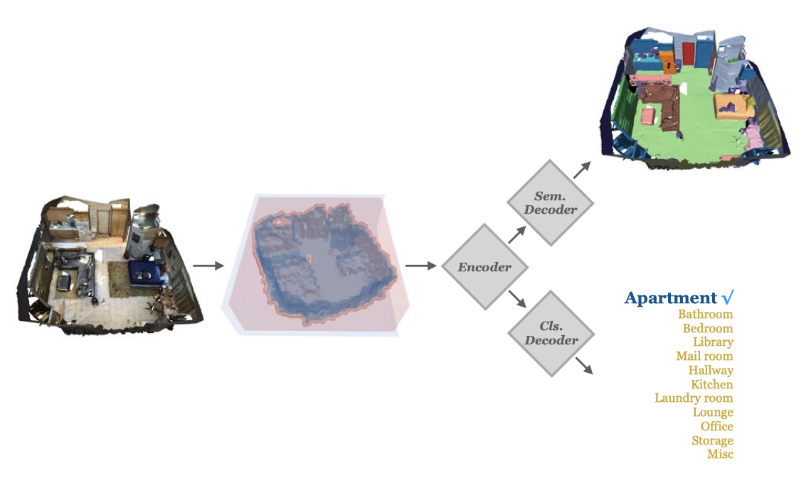

# Scene-Recognition-in-3D(IROS'20)
This repository contains the source code and pretrained models from the paper [Scene Recognition in 3D](https://arxiv.org/abs/2002.12819). 

**Indoor Scene Recognition in 3D**

Shengyu Huang, Mikhail Usvyatsov, Konrad Schindler

To the best of our knowledge, we are the first to study the task of indoor scene recognition in 3D.


## Citation 
If you find our work useful, please consider citing
```shell
@article{huang2020indoor,
  title={Indoor Scene Recognition in 3D},
  author={Huang, Shengyu and Usvyatsov, Mikhail and Schindler, Konrad},
  journal={IROS},
  year={2020}
}
```

## Dependencies
The required libraries can be easily installed by runing
```shell
pip3 install -r requirements.txt
```
We use MinkowskiEngine as our 3D sparse convolution framework. If you have problem with compiling it, please refer to [MinkowskiEngine](https://github.com/StanfordVL/MinkowskiEngine) for more details.

## Data
We evaluate our model on [ScanNet benchmark](http://kaldir.vc.in.tum.de/scannet_benchmark/), the dataset is released under the [ScanNet Term of Use](http://kaldir.vc.in.tum.de/scannet/ScanNet_TOS.pdf), please contact ScanNet team for access. 

We preprocess the raw data to be pth file for efficient access. We use [torch_cluster](https://github.com/rusty1s/pytorch_cluster) for GPU-based effficient farthest point sampling, you can find a sample under the folder ``tmp``. The train/val/test split can be found under the folder ``split``.


## Pretrained model
You can download the pretrained models for testing from [here](https://drive.google.com/drive/folders/1L3L4jtUZLFQRo8IdZyba0YztSgGrgPyK?usp=sharing).

## Train and test
### DGCNN
Please change ``base_train``, ``base_val`` to your data folder. Then run 
```shell
python3 main.py
```

### PointNet++
Please change ``base_train``, ``base_val`` to your data folder. Then run 
```shell
python3 scene_classification.py --add_color True --num_points 4096
```

### sparseConv
1. For Resnet14, change ``path_train`` and ``path_val`` then run 
```shell
python3 main.py --num_points 4096 --use_color True
```

2. Follow the following 3 steps to train the multi-task learner, these three parts only differ slightly in our implementation, please refer to three folders respectively for more details: 

- train the sparse encoder and semantic segmentation decoder
- freeze the encoder then train the sparse classification decoder 
- finetune both encoder and decoder with small lr

## References
Here are some great resources we benefit:

- [Pointnet++](https://github.com/erikwijmans/Pointnet2_PyTorch)
- [DGCNN](https://github.com/WangYueFt/dgcnn)
- [SpatioTemporalSegmentation](https://github.com/chrischoy/SpatioTemporalSegmentation)

I personally also recommend these three repositories regarding sparse convolution to you:

- [MinkowskiEngine](https://github.com/StanfordVL/MinkowskiEngine)
- [SparseConvNet](https://github.com/facebookresearch/SparseConvNet)
- [ILA-SCNN](https://github.com/TimoHackel/ILA-SCNN)
